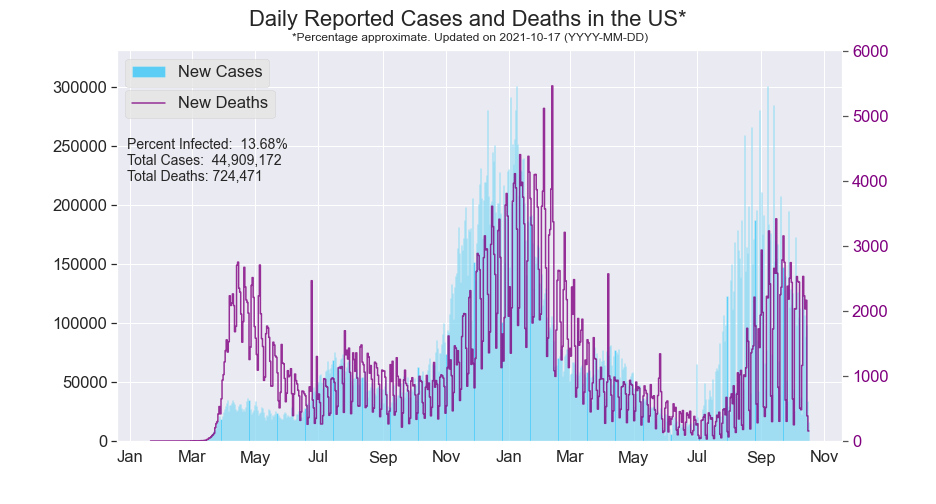
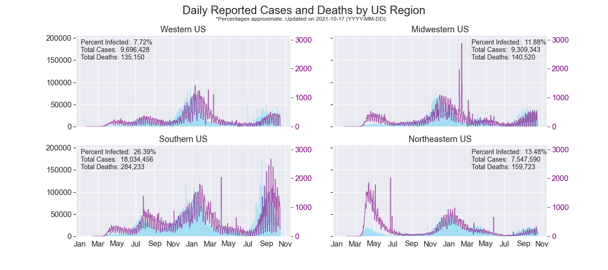
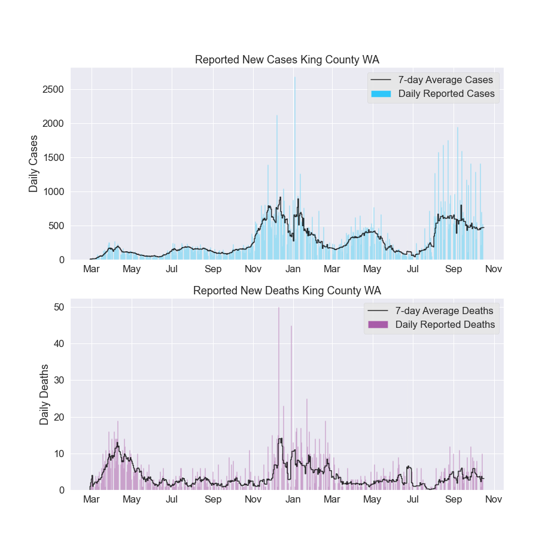

<!--
For a project, write out the following:

Describing what you did
How you did it
What tools you used
What techniques you used
What data you used
What types of modeling you did
What you learned
Put a link to GitHub and/or a blog write up
-->

## Project Description: 
The purpose of this project is to generate choropleths at the state and county levels of the number of COVID-19 cases in the US, similar in spirit to those found on the Wikipedia page titled ["2019–20 coronavirus pandemic"](https://upload.wikimedia.org/wikipedia/commons/8/85/COVID-19_outbreak_USA_per_capita_cases_map_counties.svg), along with other visualizations depicting the virus's dynamics in the US as a whole, by regions, and other areas of interest. I would also like to animate the time series data to visualize how the virus spread according to different metrics such as new cases per day and cumulative number of cases.

## Sources of COVID-19 data:
- **[NY Times](https://github.com/nytimes/covid-19-data)**

- Alternatives to consider:

    - [CDC directory of state & territorial health department websites](https://www.cdc.gov/publichealthgateway/healthdirectories/healthdepartments.html)
    - [CDC Cases of Coronavirus Disease (COVID-19) in the U.S.](https://www.cdc.gov/coronavirus/2019-ncov/cases-updates/cases-in-us.html)
    - [Johns Hopkins CSSE](https://github.com/CSSEGISandData/COVID-19)
        - [Cleaned](https://github.com/RamiKrispin/coronavirus)
    
#### Troubleshooting and Additional Resources:
- [The Institute for Health Metrics and Evaluation (IHME)](http://covid19.healthdata.org/united-states-of-america/washington?mkt_tok=eyJpIjoiT0dGbE9UaGhZV0ZsTkRJNSIsInQiOiJpMjBzb2N2WUpYUFM2RWFiQzZ0RGNYNVhMNEQrdytmb2ZVZkNwWSsyUFhiWjR6K1ZCWGtjR3k3c0dBckY0VEJORTVVR3o2cUFGRkJodzdBdW9EOVZZalwvSEhnRGRpTWtGN1hFbUJNSzgzQnVEM01CbEs5SFwvMHZPVjBwUzZuMGZyIn0%3D)
- [The COVID Tracking Project](https://covidtracking.com/)


## Installation and Running the Scripts
Install requirements in a virtual environment

```
python3 --version
virtualenv env --python=python3
source env/bin/activate
pip install -r requirements.txt
```

Make sure you have a high enough python version (3.5 or higher). To launch the scripts, run

```
source env/bin/activate
```

once per terminal. Then, run

```
cd src
python3 make_fig_usa.py
```

for instance to run the script to generate a figure displaying the history of cases and deaths in the US.

### Travis CI
Here is an explaination of the contents of the `.travis.yml` file. The first line states that we are building a Python project
```
language: python
```
The second details the Python versions we want to build
```
python:
  - 3.6
```
The third, details, in order, the set of pre-install commands we want to run. In particular, we should always work with the most updated version of `pip`
```
before_install:
  - python --version
  - pip install -U pip
  - pip install -U pytest
  - pip install codecov
```
Since commands are run in the repository’s root folder, and we have a pip-installable package, we pip install “this” folder (i.e. . ) with the optional test dependencies.
```
install:
  - pip install ".[test]" . 
```
Next, we detail the test scripts we wish to run
```
script: pytest # run tests
```

Finally, the last line details commands to run after the test script finishes successfully. Here, we report test coverage results to codecov.io
```
after_success:
  - codecov 
```

## Results:




