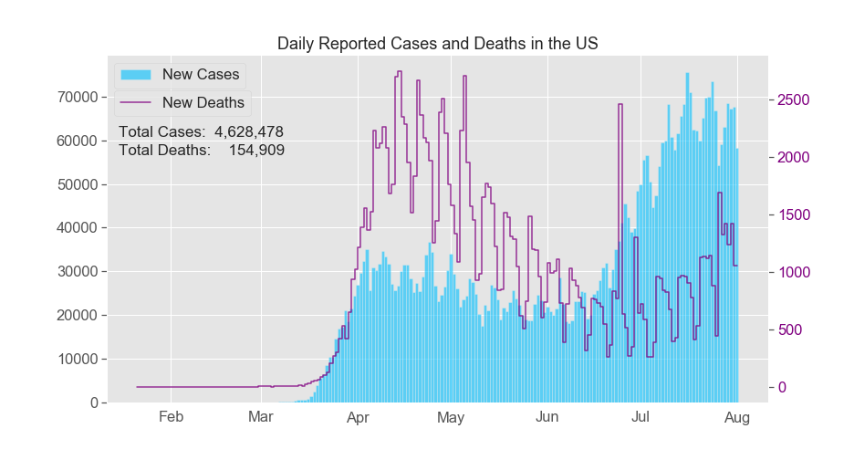
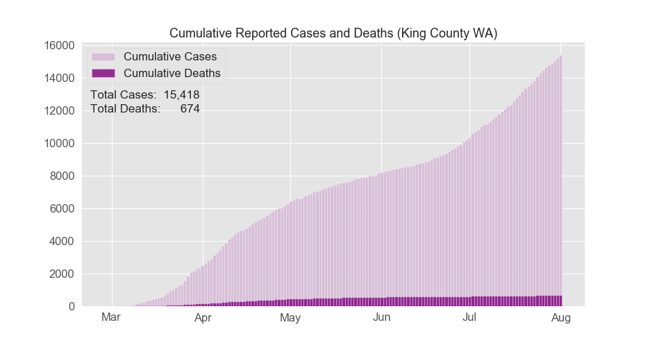

## Project Description: 
I think it would be interesting to generate choropleths of the number of COVID-19 cases in the US, similar in spirit to the one from the Wikipedia page titled ["2019–20 coronavirus pandemic"](https://upload.wikimedia.org/wikipedia/commons/8/85/COVID-19_outbreak_USA_per_capita_cases_map_counties.svg). However, I'd like to animate the time series data to visualize how the virus spread according to different metrics such as new cases per day and cumulative number of cases. If possible, I’d also be interested in seeing how the number of cases relates to: 
- population density
- proximity to airports 
- economic disparity/spread or income 
- overall political orientation 

etc (at least at a naive level).

## Results:

#### Sources of COVID-19 data:
- **[NY Times](https://github.com/nytimes/covid-19-data)**
- [Higher resolution NYC data](https://github.com/nychealth/coronavirus-data)

- Alternatives to possibly consider:

    - [CDC directory of state & territorial health department websites](https://www.cdc.gov/publichealthgateway/healthdirectories/healthdepartments.html)
    - [CDC Cases of Coronavirus Disease (COVID-19) in the U.S.](https://www.cdc.gov/coronavirus/2019-ncov/cases-updates/cases-in-us.html)
    - [Johns Hopkins CSSE](https://github.com/CSSEGISandData/COVID-19)
        - [Cleaned](https://github.com/RamiKrispin/coronavirus)
    
#### Troubleshooting and Additional Resources:
- [The Institute for Health Metrics and Evaluation (IHME)](http://covid19.healthdata.org/united-states-of-america/washington?mkt_tok=eyJpIjoiT0dGbE9UaGhZV0ZsTkRJNSIsInQiOiJpMjBzb2N2WUpYUFM2RWFiQzZ0RGNYNVhMNEQrdytmb2ZVZkNwWSsyUFhiWjR6K1ZCWGtjR3k3c0dBckY0VEJORTVVR3o2cUFGRkJodzdBdW9EOVZZalwvSEhnRGRpTWtGN1hFbUJNSzgzQnVEM01CbEs5SFwvMHZPVjBwUzZuMGZyIn0%3D)
- [The COVID Tracking Project](https://covidtracking.com/)
